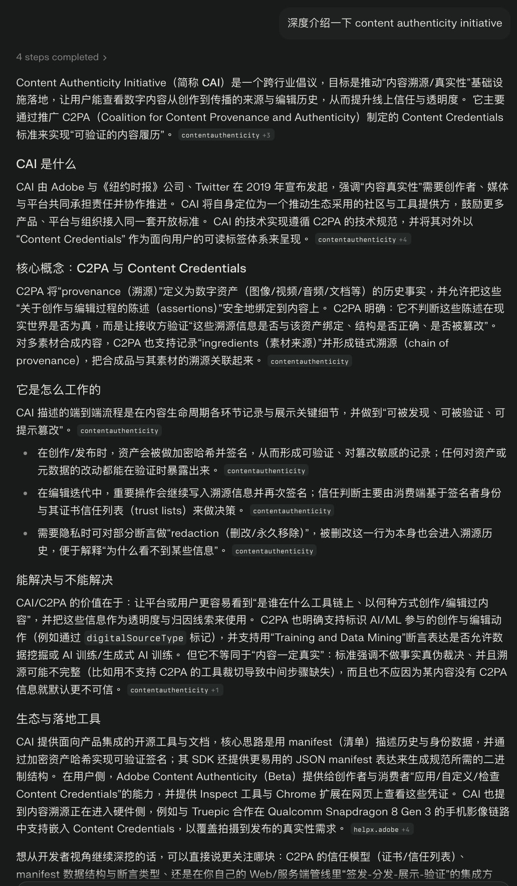
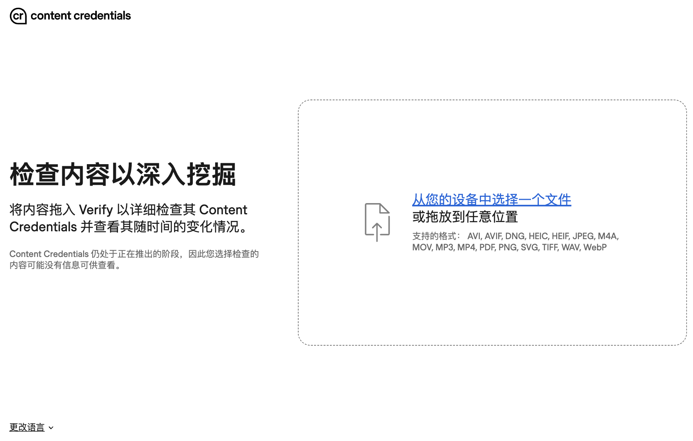
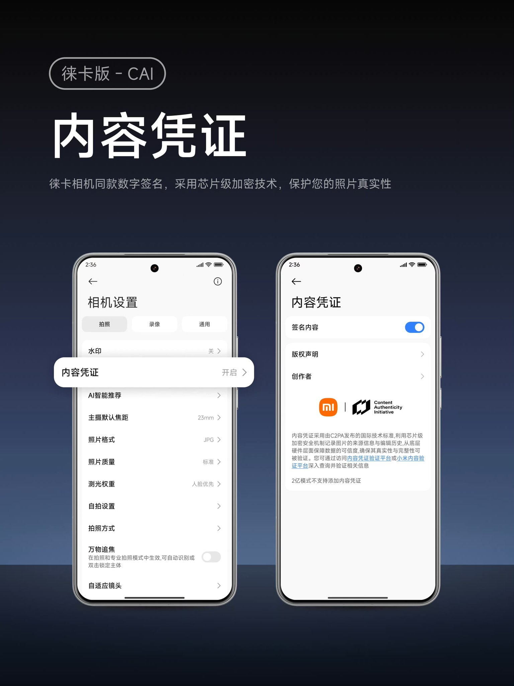
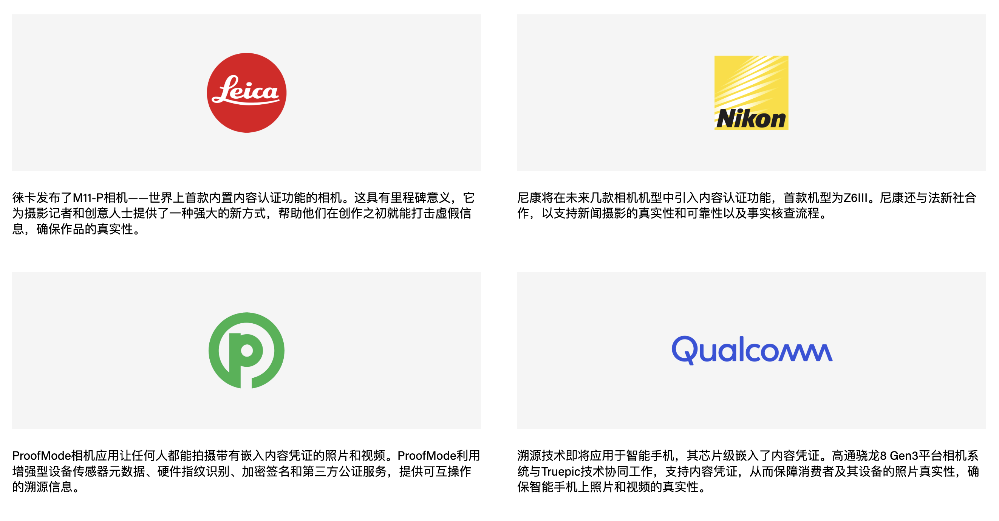

起因是刷到一个拿照片锤名人的八卦帖。我不知道那些照片是不是真的，也不关心。但这样的照片，现在*可以*用 AI 生成吧？

拿 AI 生成的图片用作**退款证据**或**法律证据**的事件，现在已经在发生了。
或许法庭可以未来不采用图片数据，商家可以不采信或是采用更严格的流程，但恶意的 AI 生成图片依旧可以发到公开平台引导舆论，进行造谣，抹黑...

---

这样的问题有几种潜在的解决方案。

一种，是让 AI 图像生成模型不生成名人。这个方案随着开源图像生成模型的进展和微调技术的普及，已经失败了。反破限再强，也跟开源模型没啥关系。而且这只能保护名人... 如果是普通人被抹黑呢？被造谣呢？

另一种，是让 AI 模型生成的图自带水印，比如谷歌 nano banana 生成的模型自带隐形 SynthID 水印。但如果开源模型能够做出类似的效果，就有很多 AI 生成图像会没有水印。你不太可能在开源模型上强制加隐形水印，总有人能移除模型中添加水印的部分的。`(连 LLM 权重中的反 nsfw 倾向都能给干掉的话，很难想象添加水印的部分会移除不掉)`

我认为比较靠谱的，不是标识假的图片，而是标识真的图片。让手机/相机拍的图片有办法验证真实性和完整性。只能是手机厂商让照片自身有办法证明自己的完整性和真实性了。

不检测假的图片，只验证真的图片？反正你验证不了你是真的，我们就默认你是假的。

---

简单研究了一下，发现已经有解决方案了？

有个叫 [Content Authenticity Initiative](https://contentauthenticity.org/) (内容真实性倡议，CAI) 的东西，开发了一套开源的工具链，可以让图片证明自己的编辑历史，并且能够验证所有的图像编辑历史？

密码学，朋友

但这样的倡议，核心难点在拍摄设备的支持和相关工具的普及。大部分的普通人不会主动去使用这类工具，所以成功与否完全取决于手机和相机拍摄的照片是否自带类似功能。

这样的技术被应用到了小米 17 Ultra 的莱卡版... 普通版没有嘛？

虽然现在我们已经可以去下载 CAI 官方提供的相机应用直接尝试，也可以用他们提供的网站进行验证，但现在这个阶段，生态支持看起来似乎比较糟糕...

虽然合作伙伴写了很多，但谷歌没上桌，苹果没上桌，高通上桌了，但他们从 888 那代就上车了，现在怎么没水花呢？如果手机厂商没上桌，只能说这个倡议还有很长一段路要走呢...
https://verify.contentauthenticity.org/

---

随着音频编辑模型的完善，同样的问题也会到音频和视频领域。这个 CAI 似乎也支持音频和视频？不过每个领域我们都要玩一遍这个流程？
